# 004 Flow Viz：Hyaxon Tour Guide Robot 仿真启动与导览流程

本文面向刚接手项目的新同事，依据用户给出的运行日志，逐项对照当前工程源码和容器内安装的 TurtleBot4、Create3 launch 文件，解释从 MacBook Pro 远程登录 Dell Notebook，到 Docker 容器、Gazebo Sim、ROS 2 bridge、Create3 控制器、传感器 topic，再到源码中导览任务层的整体框架。

## 0.核心结论

- 当前日志实际执行的是 `ros2 launch tourbot_bringup sim.launch.py`，并且使用默认参数。
- `sim.launch.py` 默认 `use_custom_sim=true`、`gazebo_gui=true`、`localization=false`、`slam=false`、`nav2=false`、`rviz=false`。
- 因此，本次日志已经启动：`cardboard_city` Gazebo 世界、TurtleBot4 与 standard dock 实体、`ros2_control` 控制器、Gazebo 到 ROS 的桥接、TurtleBot4 节点、Create3 仿真辅助节点、Create3 状态节点、LiDAR/OAK-D/碰撞/悬崖/IR 等传感器 topic。
- 本次日志没有启动：AMCL、Nav2、RViz、AprilTag 检测节点、`align_to_apriltag_server`、`wait_for_tag_removed_server`、`door_behavior_server`、`tour_deliberation_node`。这些属于源码中定义的导览任务层，需要额外启动 `mission.launch.py`，并且完整自动导览还需要 Nav2 已经可用。
- 日志末尾反复出现的 `diffdrive_controller` 旧时间戳警告，说明进入差速控制器的 `TwistStamped` 时间戳落后于仿真时间超过 `cmd_vel_timeout=0.5` 秒；它不是 Gazebo 或控制器启动失败。
- `turtlebot4_node` 中 `stop_motor`、`oakd/stop_camera` 服务不可用，是仿真中硬件服务不存在或未被该节点发现导致的错误日志；从当前 ROS graph 看，仿真传感器桥接和控制链仍然已经建立。

## 1.源码与运行日志对照范围

用户日志中关键命令链：

```bash
ssh dellnb
cd ~/4sim/gh-ref/tour-guide-robot/Hyaxon-tour-guide-robot
./docker_stuff/setup-host.bash
docker compose --env-file docker_stuff/.env -f docker_stuff/compose.sim.yaml up -d sim
docker compose --env-file docker_stuff/.env -f docker_stuff/compose.sim.yaml exec sim bash
source /opt/ros/jazzy/setup.bash
rosdep update --rosdistro jazzy
rosdep install --from-paths src --ignore-src -r -y --rosdistro jazzy -t buildtool -t build -t exec
colcon build --packages-select tourbot_bringup --symlink-install
source install/setup.bash
ros2 launch tourbot_bringup sim.launch.py
```

主要源码依据：

| 层级 | 关键文件 | 作用 |
|---|---|---|
| 宿主机与容器 | `docker_stuff/setup-host.bash` | 生成 `.env` 和 `.xauth`，把 X11、GPU group、代理、ROS_DOMAIN_ID 等写入 compose 环境 |
| 宿主机与容器 | `docker_stuff/compose.sim.yaml` | 构建并启动 `tourbot-sim`，host 网络、host IPC、挂载工程到 `/workspace`，提供 Gazebo/RViz 图形环境 |
| 宿主机与容器 | `docker_stuff/sim/entrypoint.bash` | source ROS Jazzy 与工作区，准备 CycloneDDS 配置 |
| 仿真入口 | `src/tourbot_bringup/launch/sim.launch.py` | 顶层仿真 launch，决定默认世界、Gazebo GUI、clock bridge、spawn、可选 AMCL/SLAM/Nav2 |
| 机器人生成 | `src/tourbot_bringup/launch/turtlebot4_tour_spawn.launch.py` | 发布机器人与 dock 描述，调用 `ros_gz_sim create` 生成实体，延迟启动控制器和桥接节点 |
| 控制器 | `src/tourbot_bringup/launch/create3_sim_control.launch.py` | 加载 `joint_state_broadcaster`，再加载 `diffdrive_controller` |
| Create3 节点 | `src/tourbot_bringup/launch/create3_nodes_no_control.launch.py` | 启动 hazards、IR、motion_control、wheel_status、mock、robot_state、kidnap、ui_mgr |
| 地图世界 | `src/tourbot_bringup/worlds/cardboard_city/world.sdf` | Gazebo 世界、物理系统、场景、墙体、模型资源 |
| 地图定位 | `src/tourbot_bringup/maps/cardboard_city/map_area.yaml` | 预建栅格地图，分辨率 `0.050`，origin `[-8.254, -2.080, 0]` |
| 导览任务 | `src/tourbot_bringup/launch/mission.launch.py` | 启动 AprilTag pipeline、行为 action server 和主任务节点 |
| 感知 | `src/tourbot_perception/launch/apriltag_pipeline.launch.py` | 启动 `apriltag_ros/apriltag_node`，接 OAK-D RGB 图像和相机内参 |
| 任务规划 | `src/tourbot_mission/tourbot_mission/tour_deliberation_node.py` | 加载 landmark，规划访问顺序，调用 Nav2 与自定义 action |
| 行为 | `src/tourbot_behaviors/tourbot_behaviors/align_to_apriltag_server.py` | 用 AprilTag 横向误差旋转对齐 |
| 行为 | `src/tourbot_behaviors/tourbot_behaviors/wait_for_tag_removed_server.py` | 等待门标签从视野中持续消失 |
| 行为 | `src/tourbot_behaviors/tourbot_behaviors/door_behavior_server.py` | 基于 odom 和 cmd_vel 执行门穿越动作 |
| 地标 | `src/tourbot_landmarks/config/cardboard_city/landmarks.yaml` | home、门和展点位姿、方向、tag_id |
| 接口 | `src/tourbot_interfaces/action/*.action` | 自定义 action 的 goal、result、feedback |

外部依赖 launch 文件来自容器内 `/opt/ros/jazzy/share`，不在本仓库 `src` 下，但日志中的大量节点由它们启动：

- `/opt/ros/jazzy/share/turtlebot4_gz_bringup/launch/ros_gz_bridge.launch.py`
- `/opt/ros/jazzy/share/turtlebot4_gz_bringup/launch/turtlebot4_nodes.launch.py`
- `/opt/ros/jazzy/share/irobot_create_gz_bringup/launch/create3_ros_gz_bridge.launch.py`
- `/opt/ros/jazzy/share/irobot_create_gz_bringup/launch/create3_gz_nodes.launch.py`
- `/opt/ros/jazzy/share/irobot_create_control/config/control.yaml`

## 2.工程模块结构

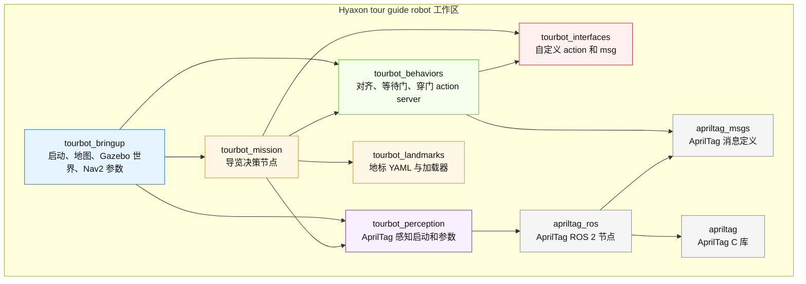

各包职责可以按“运行基础设施”和“导览业务”分两层理解：

- 基础设施层：`tourbot_bringup` 负责仿真世界、机器人生成、控制器、桥接、地图、可选定位导航。
- 业务层：`tourbot_mission` 负责导览顺序和调度；`tourbot_behaviors` 负责局部动作；`tourbot_perception` 负责 AprilTag 检测；`tourbot_landmarks` 提供地标数据；`tourbot_interfaces` 固化 action 契约。

## 3.主机、Docker、GUI 与 ROS 运行拓扑

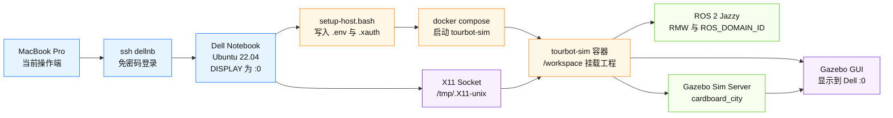

这部分与日志的对应关系：

- `echo $DISPLAY` 输出 `:0`，说明 GUI 目标是 Dell 本机 X11。
- `setup-host.bash` 输出 `Wrote .../.env` 和 `Wrote .../.xauth`，对应脚本中生成 compose 环境文件和 Xauthority 文件。
- `compose.sim.yaml` 使用 `network_mode: host`、`ipc: host`、`/workspace` 挂载、`/tmp/.X11-unix` 挂载、`LIBGL_ALWAYS_SOFTWARE=1` 和 Gazebo 资源路径。
- 容器 `entrypoint.bash` 会 source `/opt/ros/jazzy/setup.bash`，如果 `/workspace/install/setup.bash` 存在，也会 source 工作区安装环境。

## 4.当前日志的顶层启动链

当前命令未显式传 launch 参数，因此使用 `sim.launch.py` 默认值。

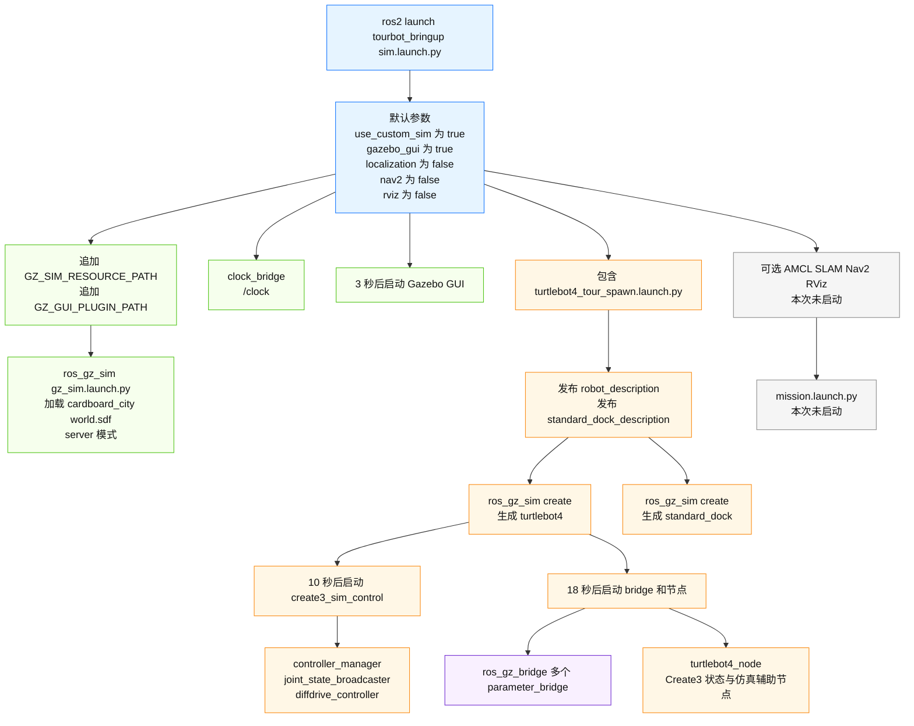

### 4.1.启动时序图

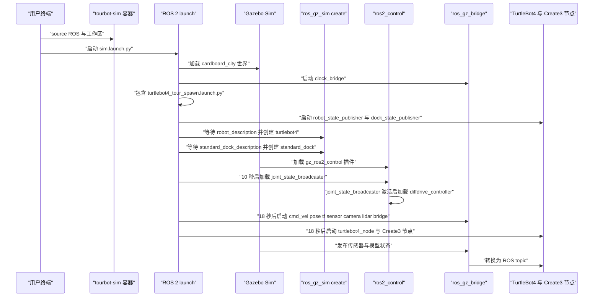

## 5.日志进程与源码映射

| 日志进程或节点 | 日志现象 | 来源 | 说明 |
|---|---|---|---|
| `gazebo-1` | Gazebo Sim Server v8.11.0，加载 `cardboard_city/world.sdf` | `sim.launch.py` 的 `custom_gazebo` | `use_custom_sim=true` 时通过 `ros_gz_sim/gz_sim.launch.py` 启动 server |
| `parameter_bridge-2` | `clock_bridge` 创建 `/clock` | `sim.launch.py` 的 `custom_clock_bridge` | Gazebo 时钟到 ROS `/clock` |
| `robot_state_publisher-3` | `robot_state_publisher` 初始化 | `turtlebot4_tour_spawn.launch.py` 包含 TurtleBot4 description launch | 发布 TurtleBot4 TF 树和 `robot_description` |
| `joint_state_publisher-4` | 等待并读取 `robot_description` | TurtleBot4 description launch | 发布 joint state，辅助 robot_state_publisher |
| `robot_state_publisher-5` | `dock_state_publisher` 初始化 | `dock_description.launch.py` | 发布 `standard_dock_description` 与 dock TF |
| `static_transform_publisher-6` | `odom` 到 `std_dock_link` | dock description 或相关外部 launch | 给 dock 建立静态 TF |
| `create-7` | 等待 `robot_description` 后实体创建成功 | `turtlebot4_tour_spawn.launch.py` 的 `spawn_robot_node` | Gazebo 中创建 `turtlebot4` |
| `create-8` | 等待 `standard_dock_description` 后实体创建成功 | `turtlebot4_tour_spawn.launch.py` 的 `spawn_dock_node` | Gazebo 中创建 `standard_dock` |
| `gazebo-9` | Gazebo GUI v8.11.0，加载 `gui.config` | `sim.launch.py` 的 `custom_gazebo_gui` | 默认 `gazebo_gui=true`，3 秒后启动 GUI 客户端 |
| `spawner-10` | 加载并激活 `joint_state_broadcaster` | `create3_sim_control.launch.py` | 先发布关节状态 |
| `spawner-11` | 加载并激活 `diffdrive_controller` | `create3_sim_control.launch.py` | 差速控制器，用 `/diffdrive_controller/cmd_vel` 驱动轮子 |
| `parameter_bridge-12` | `cmd_vel_bridge` | `create3_ros_gz_bridge.launch.py` | 桥接 `/cmd_vel` 与 `/model/turtlebot4/cmd_vel` |
| `parameter_bridge-13` | `pose_bridge` | `create3_ros_gz_bridge.launch.py` | 模型 pose 到 ground truth 内部 topic |
| `parameter_bridge-14` | `odom_base_tf_bridge` | `create3_ros_gz_bridge.launch.py` | Gazebo pose 到 ROS `/tf` |
| `parameter_bridge-15` | `bumper_contact_bridge` | `create3_ros_gz_bridge.launch.py` | `/bumper_contact` 到 ROS |
| `parameter_bridge-16` 到 `parameter_bridge-19` | cliff sensor bridge | `create3_ros_gz_bridge.launch.py` | 四个 cliff LaserScan 到 `_internal/.../scan` |
| `parameter_bridge-20` 到 `parameter_bridge-26` | IR intensity bridge | `create3_ros_gz_bridge.launch.py` | 七个 IR LaserScan 到 `_internal/.../scan` |
| `parameter_bridge-27` | `buttons_msg_bridge` | `create3_ros_gz_bridge.launch.py` | `/create3_buttons` 到 `_internal/create3_buttons` |
| `parameter_bridge-28` | `lidar_bridge` | `turtlebot4_gz_bringup/ros_gz_bridge.launch.py` | RPLIDAR scan remap 到 `/scan` |
| `parameter_bridge-29` | `camera_bridge` | `turtlebot4_gz_bringup/ros_gz_bridge.launch.py` | OAK-D image、depth、points、camera_info remap 到 `/oakd/rgb/preview/...` |
| `turtlebot4_node-30` | `Turtlebot4 lite running` | `turtlebot4_nodes.launch.py` | TurtleBot4 上层节点，当前 model 默认 `lite` |
| `hazards_vector_publisher-31` | 发布 `hazard_detection` | `create3_nodes_no_control.launch.py` | 聚合 bumper、cliff、wheel drop、backup limit |
| `ir_intensity_vector_publisher-32` | 发布 `ir_intensity` | `create3_nodes_no_control.launch.py` | 聚合 IR intensity |
| `motion_control-33` | 启用 `REFLEX_BUMP`、`REFLEX_CLIFF` 等 | `create3_nodes_no_control.launch.py` | Create3 安全反射控制 |
| `wheel_status_publisher-34` | 发布 `wheel_vels`、`wheel_ticks` | `create3_nodes_no_control.launch.py` | 轮速和编码器状态 |
| `mock_publisher-35` | 发布 mocked `slip_status` | `create3_nodes_no_control.launch.py` | 仿真中模拟状态 topic |
| `robot_state-36` | 发布 battery、stop，订阅 dock、odom | `create3_nodes_no_control.launch.py` | Create3 状态聚合 |
| `kidnap_estimator_publisher-37` | 发布 `kidnap_status` | `create3_nodes_no_control.launch.py` | 根据 hazard 等估计被抱起状态 |
| `ui_mgr-38` | 订阅 `cmd_lightring`、`cmd_audio` | `create3_nodes_no_control.launch.py` | UI 灯环和音频命令管理 |
| `pose_republisher_node-39` | 运行中 | `create3_gz_nodes.launch.py` | Gazebo pose 转 ROS odom 或 ground truth |
| `sensors_node-40` | 运行中 | `create3_gz_nodes.launch.py` | Gazebo 仿真传感器辅助 |
| `interface_buttons_node-41` | 运行中 | `create3_gz_nodes.launch.py` | 仿真按钮接口 |
| `static_transform_publisher-42` | `rplidar_stf` | `turtlebot4_tour_spawn.launch.py` | `rplidar_link` 到 Gazebo sensor frame |
| `static_transform_publisher-43` | `camera_stf` | `turtlebot4_tour_spawn.launch.py` | `oakd_rgb_camera_optical_frame` 到 Gazebo camera frame |

## 6.当前 ROS graph 结构

当前运行环境查询到的节点与日志一致，节点可以分组理解：

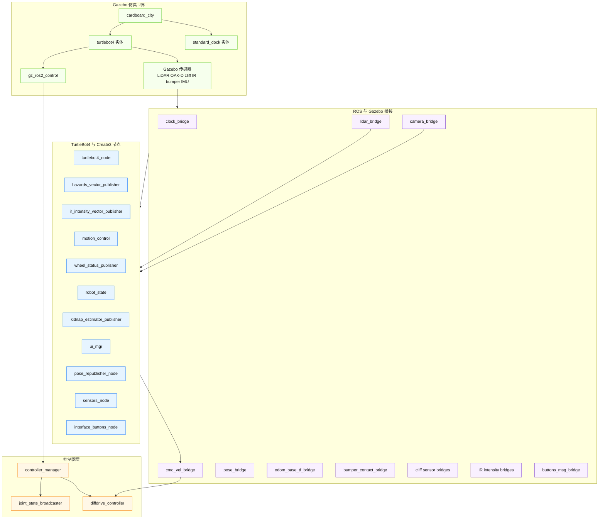

当前 ROS topic 关键分组：

| 类别 | Topic | 类型或用途 |
|---|---|---|
| 时间 | `/clock` | Gazebo sim time |
| 控制输入 | `/cmd_vel` | `geometry_msgs/msg/TwistStamped`，外部或行为层速度命令入口 |
| 控制输入 | `/diffdrive_controller/cmd_vel` | 差速控制器实际消费的速度命令 |
| 里程计 | `/odom` | `nav_msgs/msg/Odometry` |
| TF | `/tf`、`/tf_static` | 动态和静态坐标变换 |
| 关节 | `/joint_states`、`/dynamic_joint_states` | 机器人关节状态 |
| LiDAR | `/scan` | RPLIDAR LaserScan |
| 相机 | `/oakd/rgb/preview/image_raw` | OAK-D RGB 图像 |
| 相机 | `/oakd/rgb/preview/camera_info` | OAK-D 相机内参 |
| 相机 | `/oakd/rgb/preview/depth` | 深度图 |
| 相机 | `/oakd/rgb/preview/depth/points` | 点云 |
| Create3 状态 | `/battery_state`、`/dock_status`、`/stop_status` | 电池、dock、停止状态 |
| Create3 hazard | `/hazard_detection` | 聚合 hazard |
| Create3 IR | `/ir_intensity` | 聚合 IR |
| Create3 wheel | `/wheel_vels`、`/wheel_ticks`、`/wheel_status` | 轮子状态 |
| 仿真真值 | `/sim_ground_truth_pose`、`/sim_ground_truth_dock_pose` | Gazebo pose republish |

当前 ROS action 查询到的是 Create3 内置 action：

- `/audio_note_sequence`
- `/dock`
- `/drive_arc`
- `/drive_distance`
- `/led_animation`
- `/navigate_to_position`
- `/rotate_angle`
- `/undock`
- `/wall_follow`

没有看到自定义 `/align_to_apriltag`、`/wait_for_tag_removed`、`/door_traverse`，原因是本次只启动了 `sim.launch.py`，没有启动 `mission.launch.py`。

## 7.Gazebo 世界、机器人、dock 与控制器

### 7.1.Gazebo 世界

`src/tourbot_bringup/worlds/cardboard_city/world.sdf` 定义：

- 世界名：`cardboard_city`。
- 物理配置：`ode`，`max_step_size=0.001`，`real_time_update_rate=1000`，`real_time_factor=1.0`。
- 系统插件：Physics、UserCommands、SceneBroadcaster、Contact、Imu。
- 场景：浅色背景、无阴影、无网格。
- 地面：`ground_plane`。
- 墙体：`map_walls`，注释说明由 `map_area.pgm` 生成，`818` 个 occupied cell，`6` 个 component，`113` 个 box link。

日志中对应：

- `Loading SDF world file .../worlds/cardboard_city/world.sdf`
- `Loaded system [gz::sim::systems::Physics]`
- `Loaded system [gz::sim::systems::Contact]`
- `Loaded system [gz::sim::systems::Imu]`
- `World [cardboard_city] initialized with [1ms] physics profile`

### 7.2.机器人与 dock 生成

`turtlebot4_tour_spawn.launch.py` 中：

- `robot_name = turtlebot4`
- `dock_name = standard_dock`
- `spawn_robot_node` 从 `robot_description` topic 读 URDF/SDF 并创建 `turtlebot4`。
- `spawn_dock_node` 从 `standard_dock_description` topic 读 dock 描述并创建 `standard_dock`。
- dock 位姿相对机器人使用 `0.157` 米偏移，并把 yaw 旋转 `3.1416`。

日志中对应：

- `Waiting messages on topic [robot_description]`
- `Waiting messages on topic [standard_dock_description]`
- `Entity creation successful`
- `Created entity ... named [standard_dock]`
- `Created entity ... named [turtlebot4]`

### 7.3.控制器启动链

```mermaid
flowchart LR
    Spawned["turtlebot4 实体创建完成"]
    Plugin["Gazebo 加载 gz_ros2_control 插件"]
    Hardware["加载 left_wheel_joint 与 right_wheel_joint"]
    Manager["controller_manager 初始化"]
    JointSpawner["spawner\njoint_state_broadcaster"]
    JointActive["joint_state_broadcaster 激活"]
    DiffSpawner["spawner\ndiffdrive_controller"]
    DiffActive["diffdrive_controller 激活"]
    Cmd["/diffdrive_controller/cmd_vel"]
    Wheels["左右轮 velocity command"]
    Odom["/odom 与 /tf"]

    Spawned --> Plugin --> Hardware --> Manager --> JointSpawner --> JointActive --> DiffSpawner --> DiffActive
    Cmd --> DiffActive --> Wheels
    DiffActive --> Odom

    classDef event fill:#E6F4FF,stroke:#1677FF,color:#111;
    classDef control fill:#FFF7E6,stroke:#FA8C16,color:#111;
    classDef output fill:#F6FFED,stroke:#52C41A,color:#111;
    class Spawned,Plugin,Hardware event;
    class Manager,JointSpawner,JointActive,DiffSpawner,DiffActive control;
    class Cmd,Wheels,Odom output;
```

控制器源码与配置：

- `create3_sim_control.launch.py` 先启动 `joint_state_broadcaster`。
- `OnProcessExit` 监听 `joint_state_broadcaster_spawner` 退出，再启动 `diffdrive_controller_spawner`。
- 控制参数来自 `/opt/ros/jazzy/share/irobot_create_control/config/control.yaml`。
- `control.yaml` 定义左右轮：`left_wheel_joint`、`right_wheel_joint`。
- `wheel_separation=0.233`，`wheel_radius=0.03575`。
- `publish_rate=62.0`。
- `cmd_vel_timeout=0.5`。
- `enable_odom_tf=true`。

## 8.ROS 与 Gazebo bridge 数据流

```mermaid
flowchart TB
    subgraph GZ["Gazebo Transport"]
        GzClock["/clock"]
        GzCmd["/model/turtlebot4/cmd_vel"]
        GzPose["/model/turtlebot4/pose"]
        GzTf["/model/turtlebot4/tf"]
        GzBumper["/bumper_contact"]
        GzCliff["cliff scan topics"]
        GzIr["IR scan topics"]
        GzLidar["rplidar scan topic"]
        GzCamera["rgbd_camera image depth points camera_info"]
        GzButtons["/create3_buttons"]
    end

    subgraph Bridges["parameter_bridge 节点"]
        ClockBridge["clock_bridge"]
        CmdBridge["cmd_vel_bridge"]
        PoseBridge["pose_bridge"]
        TfBridge["odom_base_tf_bridge"]
        BumperBridge["bumper_contact_bridge"]
        CliffBridge["cliff bridges"]
        IrBridge["IR bridges"]
        LidarBridge["lidar_bridge"]
        CameraBridge["camera_bridge"]
        ButtonsBridge["buttons_msg_bridge"]
    end

    subgraph ROS["ROS 2 Topic"]
        RosClock["/clock"]
        RosCmd["/cmd_vel 与 /diffdrive_controller/cmd_vel"]
        RosPose["/_internal/sim_ground_truth_pose\n/_internal/sim_ground_truth_dock_pose"]
        RosTf["/tf"]
        RosBumper["/bumper_contact"]
        RosCliff["_internal cliff scans"]
        RosIr["_internal IR scans"]
        RosScan["/scan"]
        RosCamera["/oakd/rgb/preview/image_raw\n/oakd/rgb/preview/camera_info\n/oakd/rgb/preview/depth\n/oakd/rgb/preview/depth/points"]
        RosButtons["_internal/create3_buttons"]
    end

    GzClock --> ClockBridge --> RosClock
    GzCmd --> CmdBridge --> RosCmd
    GzPose --> PoseBridge --> RosPose
    GzTf --> TfBridge --> RosTf
    GzBumper --> BumperBridge --> RosBumper
    GzCliff --> CliffBridge --> RosCliff
    GzIr --> IrBridge --> RosIr
    GzLidar --> LidarBridge --> RosScan
    GzCamera --> CameraBridge --> RosCamera
    GzButtons --> ButtonsBridge --> RosButtons

    classDef gz fill:#F6FFED,stroke:#52C41A,color:#111;
    classDef bridge fill:#F9F0FF,stroke:#722ED1,color:#111;
    classDef ros fill:#E6F4FF,stroke:#1677FF,color:#111;
    class GzClock,GzCmd,GzPose,GzTf,GzBumper,GzCliff,GzIr,GzLidar,GzCamera,GzButtons gz;
    class ClockBridge,CmdBridge,PoseBridge,TfBridge,BumperBridge,CliffBridge,IrBridge,LidarBridge,CameraBridge,ButtonsBridge bridge;
    class RosClock,RosCmd,RosPose,RosTf,RosBumper,RosCliff,RosIr,RosScan,RosCamera,RosButtons ros;
```

特别注意 `cmd_vel_bridge`：

- 它创建了 Gazebo 到 ROS 的 `/cmd_vel` bridge，也创建了 ROS 到 Gazebo 的 `/model/turtlebot4/cmd_vel` bridge。
- 日志里 `Passing message from ROS geometry_msgs/msg/TwistStamped to Gazebo gz.msgs.Twist` 表示已经有 ROS 侧速度消息进入 Gazebo。
- Gazebo GUI 的 Teleop 插件配置 topic 为 `/cmd_vel`，因此点击 GUI teleop 或相关默认发布可能会产生 `TwistStamped`。
- `diffdrive_controller` 后续提示旧时间戳，说明消息 stamp 与仿真 `/clock` 有时间差，超过 `0.5` 秒 timeout。

## 9.完整导览业务层

这部分是源码定义的目标业务流程，本次日志没有启动。启动入口是 `src/tourbot_bringup/launch/mission.launch.py`。

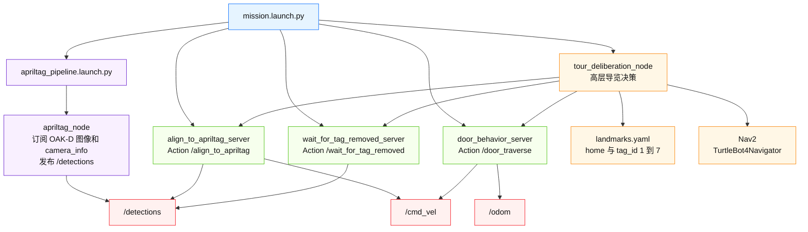

### 9.1.mission.launch.py 启动顺序

`mission.launch.py` 明确做了延迟启动，目的是让依赖项先起来：

| 时间 | 节点 | 目的 |
|---|---|---|
| 立即 | `apriltag_pipeline.launch.py` | 启动 AprilTag 感知 |
| 2.0 秒 | `align_to_apriltag_server` | 对齐 action server |
| 2.5 秒 | `wait_for_tag_removed_server` | 等待 tag 消失 action server |
| 3.0 秒 | `door_behavior_server` | 门穿越 action server |
| 10.0 秒 | `tour_deliberation_node` | 主任务节点，最后启动以等待 action server 可用 |

### 9.2.AprilTag pipeline

`apriltag_pipeline.launch.py`：

- 启动 `apriltag_ros` 的 `apriltag_node`。
- node 名为 `apriltag`。
- 参数文件为 `tourbot_perception/config/apriltags_36h11.yaml`。
- `family=36h11`，`size=0.162`，`max_hamming=0`，`z_up=true`。
- remap：
  - `image_rect` 到 `/oakd/rgb/preview/image_raw`
  - `camera_info` 到 `/oakd/rgb/preview/camera_info`
- 默认发布 `detections`，在当前无 namespace 场景下即 `/detections`，正好匹配行为 server 默认订阅 topic。

### 9.3.地标数据

`tourbot_landmarks/config/cardboard_city/landmarks.yaml`：

| 名称 | tag_id | x | y | theta | 业务含义 |
|---|---:|---:|---:|---|---|
| `home` | 0 | 0 | 0 | NORTH | 起点和回家点 |
| `door_outward` | 1 | 3.14 | 0 | SOUTH | 外开门 |
| `door_inward` | 2 | 1.71 | 0 | NORTH | 内开门 |
| `goal_3` | 3 | 0.942 | 0.495 | WEST | 普通展点 |
| `goal_4` | 4 | 1.33 | -0.2 | EAST | 普通展点 |
| `goal_5` | 5 | 3.36 | -0.2 | EAST | 普通展点 |
| `goal_6` | 6 | 2.34 | -0.647 | WEST | 普通展点 |
| `goal_7` | 7 | 2.35 | 0.673 | EAST | 普通展点 |

`tourbot_mission` 中 `is_door_tag` 将 tag `1` 和 tag `2` 视为门标签。

### 9.4.导览决策流程

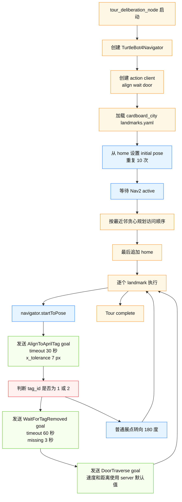

源码注意点：

- `get_nearest_landmark` 使用当前位置到候选点的平方距离，做简单最近邻贪心排序。
- `landmark_to_pose` 把 YAML 中 `NORTH`、`SOUTH`、`EAST`、`WEST` 转为 TurtleBot4Navigator 的方向角。
- 对每个地标调用 `navigator.startToPose(goal_pose)` 后，源码当前只固定 `sleep(1.5)`，没有显式等待 Nav2 到达结果。若后续需要严格“到点后再识别 tag”，应检查 `TurtleBot4Navigator` 的推荐等待接口或增加导航状态检查。
- 门流程先对齐 tag，再等待 tag 从视野中消失，最后执行穿门动作。
- 普通展点对齐后，源码用旋转 180 度的 pose 让机器人转身离开展点。

## 10.自定义 action 接口

| Action | Goal | Result | Feedback | 调用关系 |
|---|---|---|---|---|
| `AlignToAprilTag` | `tag_id`、`timeout_sec`、`x_tolerance_px` | `success`、`message` | `x_error_px`、`tag_visible`、`state` | mission 调用 align server |
| `WaitForTagRemoved` | `tag_id`、`timeout_sec`、`missing_duration_sec` | `success`、`message` | `tag_visible`、`missing_time_sec`、`state` | mission 调用 wait server |
| `DoorTraverse` | `tag_id`、`backup_distance`、`backup_speed`、`wait_seconds`、`forward_distance`、`forward_speed` | `success`、`message` | `current_state`、`distance_traveled` | mission 调用 door server |
| `DoLandmarkTask` | `waypoint_index`、`expected_landmark_name`、`expected_tag_id` | `success`、`detected_tag_id`、`message` | `status` | 接口存在，当前 `landmark_task_server.py` 仍是 TODO |

## 11.AlignToAprilTag 行为状态

源码：`src/tourbot_behaviors/tourbot_behaviors/align_to_apriltag_server.py`

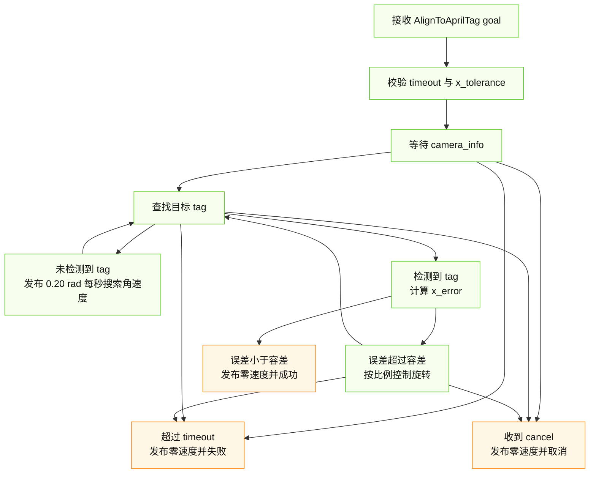

关键实现：

- 订阅 `/detections` 和 `/oakd/rgb/preview/camera_info`。
- 发布 `/cmd_vel`，消息类型为 `TwistStamped`。
- 找不到 tag 时按 `SEARCH_ANGULAR_SPEED=0.20` 原地旋转。
- 找到 tag 后，用图像中心和 `detection.centre.x` 算横向像素误差。
- 控制律：`angular_z = -0.003 * x_error`，并限制在 `[-0.30, 0.30]`。
- 达到 `x_tolerance_px` 后发布零速度并成功。

## 12.WaitForTagRemoved 行为状态

源码：`src/tourbot_behaviors/tourbot_behaviors/wait_for_tag_removed_server.py`

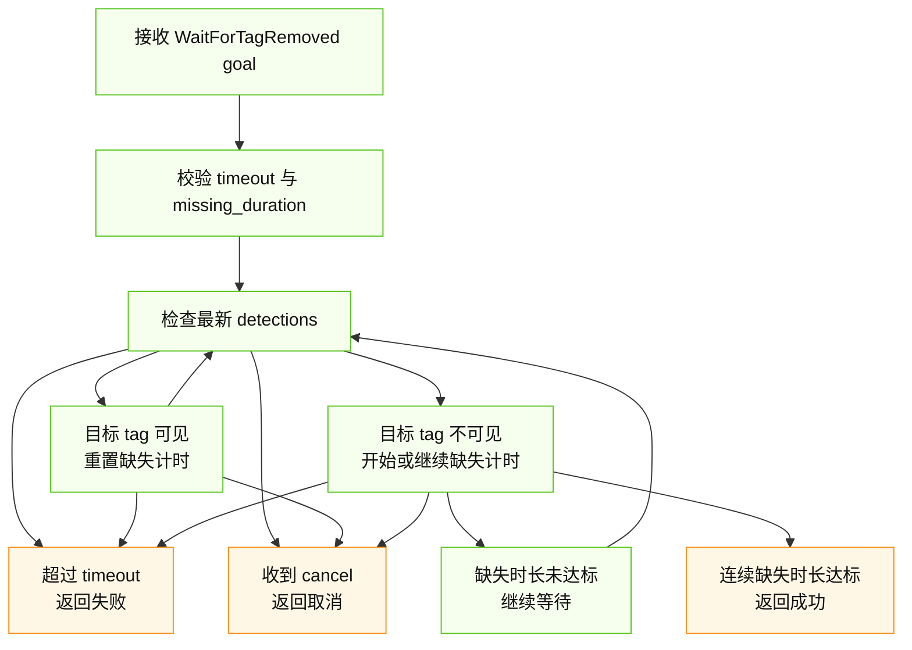

关键实现：

- 订阅 `/detections`。
- 默认控制频率 `20 Hz`。
- tag 可见时持续反馈 `TAG_VISIBLE`，并重置缺失计时。
- tag 不可见时进入 `TAG_MISSING`，只有连续缺失时间达到 goal 中的 `missing_duration_sec` 才成功。
- mission 对门标签使用 `timeout_sec=60.0`、`missing_duration_sec=3.0`。

## 13.DoorTraverse 行为状态

源码：`src/tourbot_behaviors/tourbot_behaviors/door_behavior_server.py`

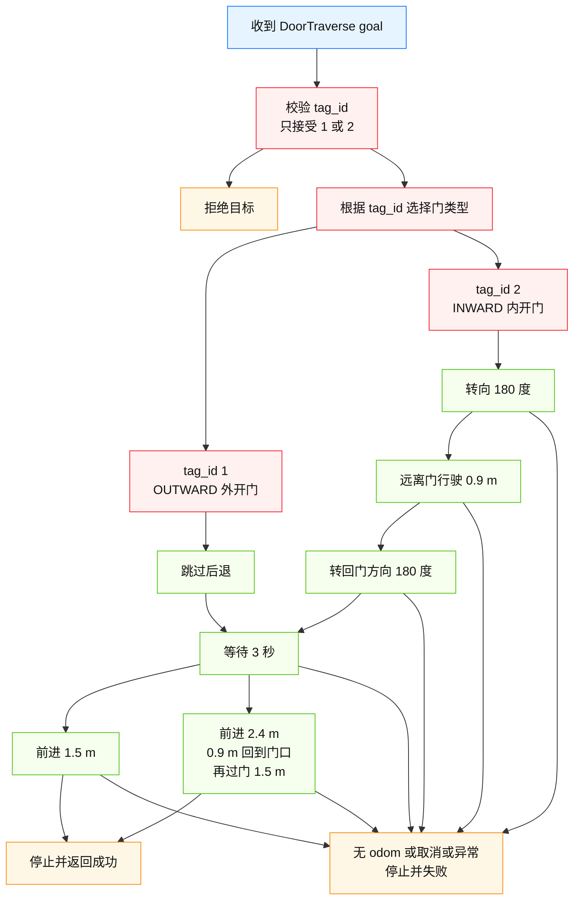

关键实现：

- 订阅 `/odom`，发布 `/cmd_vel`。
- 默认参数：
  - `backup_distance_default=0.9`
  - `backup_speed_default=0.15`
  - `wait_seconds_default=3.0`
  - `forward_distance_default=1.5`
  - `forward_speed_default=0.18`
  - `control_rate_hz=20.0`
- `tag_id=1` 外开门：不后退，等待，然后向前 `1.5 m`。
- `tag_id=2` 内开门：先转身，向远离门方向行驶 `0.9 m`，再转回，等待，然后向前总计 `2.4 m`，保证最终在原门位前方 `1.5 m`。
- goal 中距离和速度如果为 `0.0`，server 使用默认值；mission 当前正是把这些字段设为 `0.0`，依赖 server 默认参数。

## 14.完整系统数据流

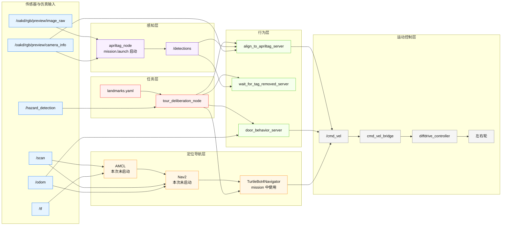

这张图是“完整目标系统”。当前日志只覆盖了 Sensors 和 Control 中的大部分节点，以及基础 bridge；Nav、Perception、Mission、Behaviors 在本次日志里未启动。

## 15.日志中的 warning 与 error 解读

| 日志内容 | 位置 | 含义 | 严重性 |
|---|---|---|---|
| `groups: cannot find name for group ID 110` | 进入容器时 | compose 把 render group ID 加进容器，但容器内没有对应 group name | 低，不影响运行 |
| `Old-style arguments are deprecated` | `static_transform_publisher` | 当前 launch 使用旧式参数顺序 | 低，后续可改新式参数 |
| `root link ... has an inertia specified` | `robot_state_publisher` | KDL 不支持 root link inertia，建议加 dummy link | 低，常见 URDF warning |
| `Gazebo does not support Ogre material scripts` | Gazebo 载入模型 | 模型材质脚本兼容性 warning | 低，通常只影响材质显示 |
| `IMU sensor 'imu' not found in hardware_info` | `gz_ros_control` | ros2_control 硬件信息中没找到 IMU sensor | 中低，控制器仍然启动 |
| `Executor is not available during hardware component initialization` | controller manager | 硬件组件初始化阶段不能创建 node | 低，后续初始化成功 |
| `has_jerk_limits parameter is deprecated` | `diffdrive_controller` | 控制参数写法过时 | 低，功能仍可用 |
| `Received TwistStamped with zero timestamp` | `diffdrive_controller` | 收到 stamp 为零的速度命令 | 中，可能影响 teleop 或自动控制 |
| `Ignoring the received message ... older than current time` | `diffdrive_controller` | 速度命令时间戳旧于当前 sim time 超过 `0.5` 秒 | 中，需要排查发布端 stamp |
| `OAKD stopped`、`RPLIDAR stopped` | `turtlebot4_node` | TurtleBot4 node 中的硬件设备状态逻辑在仿真下显示 stopped | 中低，仿真 topic 仍由 bridge 提供 |
| `Service stop_motor unavailable` | `turtlebot4_node` | 仿真中没有对应硬件服务 | 中低，非当前启动失败根因 |
| `Service oakd/stop_camera unavailable` | `turtlebot4_node` | 仿真中没有对应 OAK-D 硬件服务 | 中低，camera bridge 已经存在 |

## 16.新同事阅读源码建议

建议按下面顺序读，最容易把日志和源码对上：

- 先读 `docker_stuff/setup-host.bash` 和 `docker_stuff/compose.sim.yaml`，理解为什么 GUI 能从容器显示到 Dell，以及为什么工程在容器内路径是 `/workspace`。
- 再读 `src/tourbot_bringup/launch/sim.launch.py`，确认默认参数和顶层 include。
- 然后读 `src/tourbot_bringup/launch/turtlebot4_tour_spawn.launch.py`，重点看两个 `TimerAction`：控制器延迟 `10` 秒，bridge 和机器人节点延迟 `18` 秒。
- 接着读 `create3_sim_control.launch.py` 和 `create3_nodes_no_control.launch.py`，把 controller spawner 与 Create3 状态节点对上日志。
- 再看容器内 TurtleBot4/Create3 的 bridge launch 文件，把 `parameter_bridge-12` 到 `parameter_bridge-29` 对上。
- 如果要理解完整导览，再读 `mission.launch.py`、`tour_deliberation_node.py`、三个 behavior server、`landmarks.yaml` 和 `tourbot_interfaces/action/*.action`。

## 17.从当前仿真到完整导览的启动关系

当前日志只启动仿真底座。完整导览还需要导航和任务层。

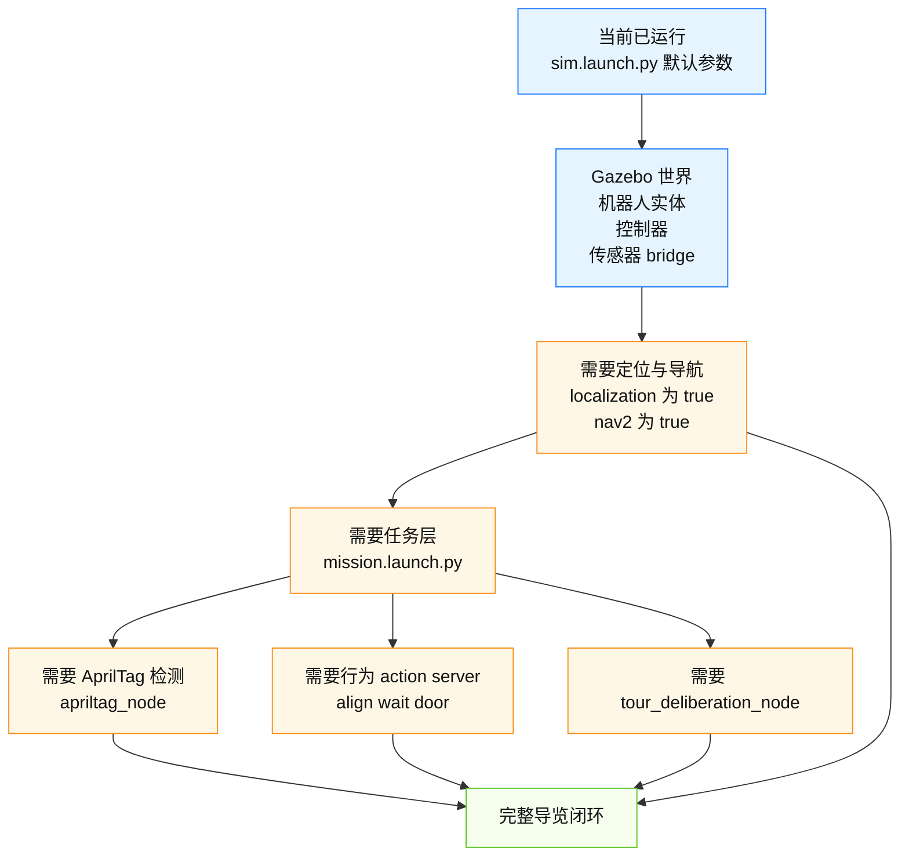

实际调试时可以把目标分成三步：

- 第一步，只验证当前日志这一层：Gazebo GUI 能看到车和 dock，`ros2 topic echo /scan`、`/odom`、`/oakd/rgb/preview/camera_info` 有数据，`ros2 control list_controllers` 能看到两个 controller active。
- 第二步，在 `sim.launch.py` 中开启 `localization:=true nav2:=true` 或使用已有导航 bringup，确认 `/map`、AMCL、Nav2 action 和 `/cmd_vel` 正常。
- 第三步，启动 `mission.launch.py`，确认 `/detections`、`/align_to_apriltag`、`/wait_for_tag_removed`、`/door_traverse` 出现，再观察 `tour_deliberation_node` 是否按 landmark 顺序调度。
