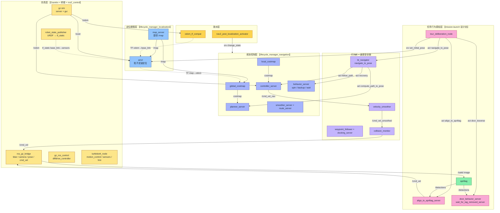
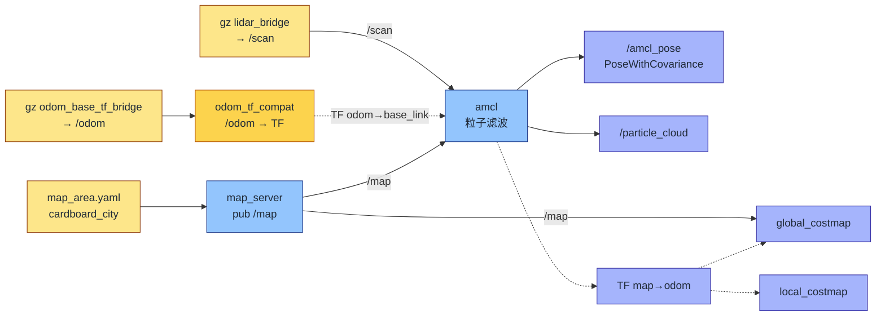
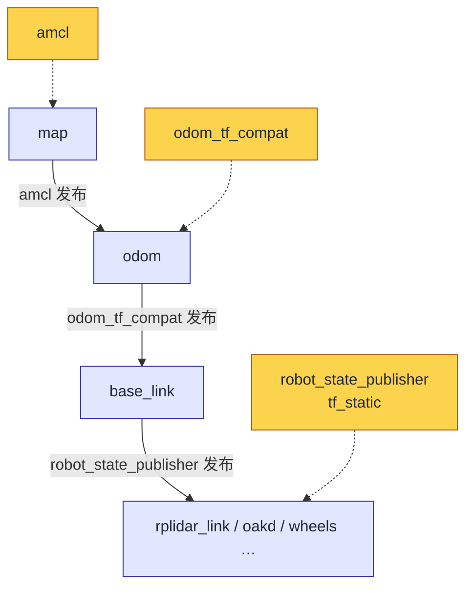
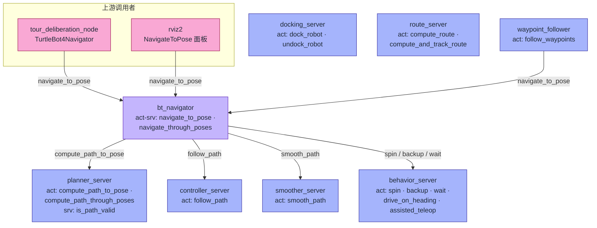
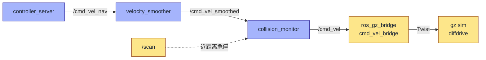
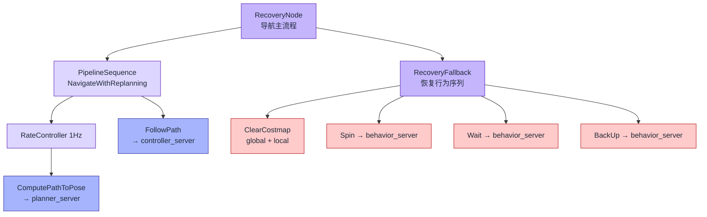
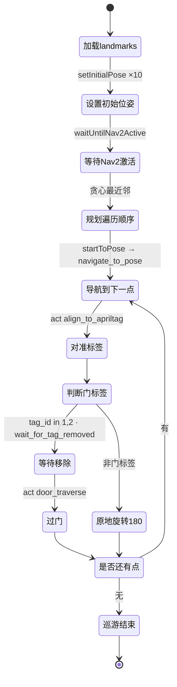
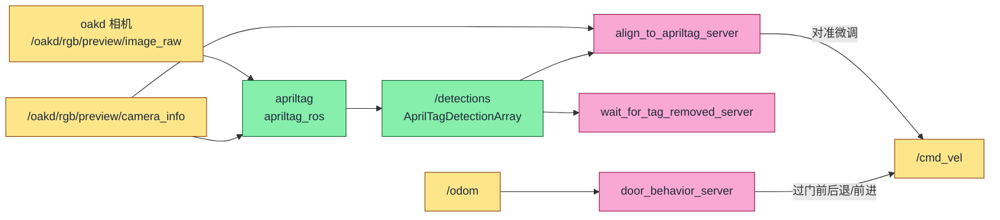
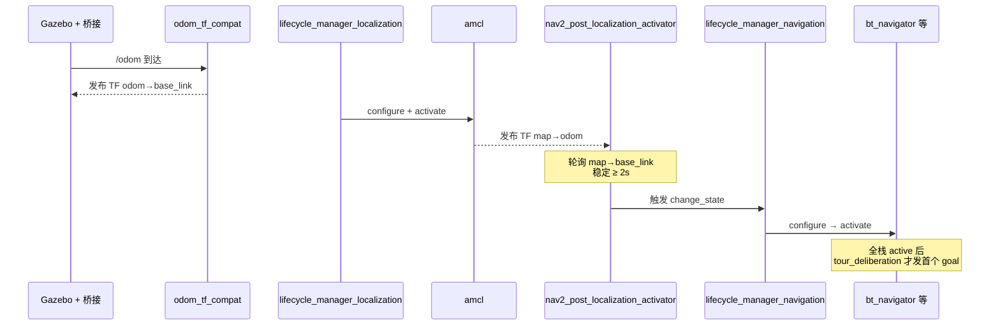

# 010 · O48 ROS2 模块关系可视化：定位建图 × Topic/Action/Service × 行为树

> 适用对象：想快速看懂「机器人跑起来后，谁跟谁说话、用什么方式说」的工程师
> 数据来源：运行容器 `hyaxon-tour-guide-robot-sim-1` （镜像 `hyaxon-tour-guide-robot:jazzy`） 的实时 `ros2 node/topic/service/action` 自省，外加 `src/` 源码静态分析。
> 采集时间：2026-06-30
> 配套图：本目录 `010-o48-ros2-relation-viz.svg` （手绘分层总图，与下文 Mermaid 等价）

---

## 0.先建立三个判断

1.**代码层 ≠ 运行层**。一个包能编出多个节点；一个 launch 能串多个包。下文所有节点名都来自当前容器 `ros2 node list` 的真实输出。

2.**当前容器实际在跑的 = 定位 + Nav2 全栈**。三组 lifecycle 节点 `amcl` / `bt_navigator` / `map_server` 实测均为 `active`。`mission` 层 （`tour_deliberation_node`、`align_to_apriltag_server`、`apriltag` 等） 由 `mission.launch.py` 启动，当前未拉起，属「设计态」，下文用浅色与注释区分。

3.**四种连接方式要分清**：topic （持续数据流）、action （带反馈的长任务）、service （一问一答）、TF （坐标变换）。本文用四种线型区分。

---

## 1.系统总览（分层拓扑）

按职责分层，颜色区分层级。实线=topic，蓝=action，绿=service，红虚线=TF。



---

## 2.定位建图核心数据流（已调通部分）

这是「定位建图逻辑」的核心闭环：传感器 → 定位 → TF → 代价地图。当前容器实测全部 `active`。



**关键事实（来自 `ros2 node info /amcl`）**

- 订阅：`/scan`、`/map`、`/initialpose`、`/tf`、`/tf_static`、`/clock`
- 发布：`/amcl_pose`、`/particle_cloud`、`/tf` （即 map→odom）
- 服务端：`/set_initial_pose` 【SetInitialPose】、`/reinitialize_global_localization` 【Empty】、`/request_nomotion_update` 【Empty】
- `map_server` 服务端：`/map_server/map` 【GetMap】、`/map_server/load_map` 【LoadMap】

---

## 3.TF 坐标树

定位建图的本质是补全 `map → odom → base_link` 这条链。三段由三个不同来源发布：



> `odom_tf_compat` 存在的原因：把 `/odom` 的 pose 用 VOLATILE QoS 重发为标准 `odom→base_link` TF，让 Nav2 的 TF 监听器能正常拿到，避免 QoS 不兼容。

---

## 4.Nav2 Action / Service 拓扑

Nav2 的核心交互是 **action**。下图标出每个 server 暴露的 action，以及 `bt_navigator` 作为「编排者」如何调用下游。



> `waypoint_follower` 内部也持 `navigate_to_pose` 的 action client，所以它既是 server 又是 client。`bt_navigator` 同理（对外 server，对自身 `navigate_to_pose` 也是 client，用于嵌套）。

---

## 5.速度指令链（cmd_vel 的层层把关）

控制输出不是直接给电机，而是经过平滑与碰撞监控两道关卡：



> 注意：`align_to_apriltag_server` 与 `door_behavior_server` 在执行精对准 / 过门时会 **直接发布 `/cmd_vel`**，绕过 Nav2 控制器，属行为层的临时接管。

---

## 6.行为树（bt_navigator 内部编排）

`nav2_params.yaml` 未指定自定义 XML，使用 Nav2 默认 `navigate_to_pose_w_replanning_and_recovery.xml`。其逻辑骨架：



**运行期观测点**：`/behavior_tree_log` 【nav2_msgs/BehaviorTreeLog】 持续广播每个 BT 节点的状态翻转，是调试行为树的第一手数据。

---

## 7.任务层状态机（tour_deliberation_node，设计态）

`tour_deliberation_node` 是顶层「大脑」，用贪心最近邻遍历 `landmarks.yaml`，每到一个点先对准 AprilTag，门标签则等人开门再过门：



**自定义 action 接口（`tourbot_interfaces`）**

| Action | Goal 关键字段 | Server |
|---|---|---|
| `align_to_apriltag` | tag_id · timeout_sec · x_tolerance_px | align_to_apriltag_server |
| `wait_for_tag_removed` | tag_id · timeout_sec · missing_duration_sec | wait_for_tag_removed_server |
| `door_traverse` | tag_id · backup/forward 距离与速度 | door_behavior_server |
| `do_landmark_task` | waypoint_index · expected_tag_id | landmark_task_server（备用） |

---

## 8.感知 + 行为层连接（设计态）



> 注意 ID 约定：`tag_id` 1=外开门、2=内开门 （`is_door_tag` 判断）。`door_detector_node.py` 已注明废弃，门检测改由 `wait_for_tag_removed_server` 完成。

---

## 9.Lifecycle 激活时序

Nav2 节点都是 lifecycle 节点，必须按序 configure→activate。本工程用自定义激活器保证「先定位、后导航」：



> 当前容器实测：`ros2 lifecycle get /amcl|/bt_navigator|/map_server` 均返回 `active [3]`，说明该时序已成功跑完。

---

## 10.关键接口速查表

| 类别 | 名称 | 类型 | 方向 |
|---|---|---|---|
| topic | `/scan` | sensor_msgs/LaserScan | gz → amcl / collision_monitor |
| topic | `/map` | nav_msgs/OccupancyGrid | map_server → amcl / costmaps |
| topic | `/amcl_pose` | geometry_msgs/PoseWithCovarianceStamped | amcl → 观测 |
| topic | `/initialpose` | geometry_msgs/PoseWithCovarianceStamped | rviz / mission → amcl |
| topic | `/cmd_vel_nav` → `/cmd_vel_smoothed` → `/cmd_vel` | geometry_msgs/TwistStamped | controller → smoother → monitor → gz |
| topic | `/plan` · `/local_plan` | nav_msgs/Path | planner / controller → 观测 |
| topic | `/particle_cloud` | nav2_msgs/ParticleCloud | amcl → rviz |
| topic | `/behavior_tree_log` | nav2_msgs/BehaviorTreeLog | bt_navigator → 调试 |
| action | `/navigate_to_pose` | nav2_msgs/NavigateToPose | client → bt_navigator |
| action | `/compute_path_to_pose` | nav2_msgs/ComputePathToPose | bt → planner_server |
| action | `/follow_path` | nav2_msgs/FollowPath | bt → controller_server |
| action | `/spin` · `/backup` · `/wait` | nav2_msgs/* | bt → behavior_server |
| action | `/align_to_apriltag` | tourbot_interfaces/AlignToAprilTag | mission → 行为 server |
| service | `/set_initial_pose` | nav2_msgs/SetInitialPose | mission → amcl |
| service | `/map_server/load_map` | nav2_msgs/LoadMap | 运维 → map_server |
| service | `/{node}/change_state` | lifecycle_msgs/ChangeState | activator / manager → 各 lifecycle 节点 |
| TF | `map → odom` | tf2 | amcl |
| TF | `odom → base_link` | tf2 | odom_tf_compat |
| TF | `base_link → sensors` | tf2_static | robot_state_publisher |

---

## 11.复现采集的命令

```bash
C=hyaxon-tour-guide-robot-sim-1
docker exec $C bash -lc "source /opt/ros/jazzy/setup.bash; ros2 node list"
docker exec $C bash -lc "source /opt/ros/jazzy/setup.bash; ros2 topic list -t"
docker exec $C bash -lc "source /opt/ros/jazzy/setup.bash; ros2 action list -t"
docker exec $C bash -lc "source /opt/ros/jazzy/setup.bash; ros2 service list -t"
docker exec $C bash -lc "source /opt/ros/jazzy/setup.bash; ros2 node info /amcl"
docker exec $C bash -lc "source /opt/ros/jazzy/setup.bash; ros2 lifecycle get /amcl"
# 运行期看行为树翻转：
docker exec $C bash -lc "source /opt/ros/jazzy/setup.bash; ros2 topic echo /behavior_tree_log"
```

---

## 附：SVG 总图

手绘分层总图见同目录 `010-o48-ros2-relation-viz.svg`，与本文第 1 节 Mermaid 等价，可直接在浏览器打开或嵌入文档。
