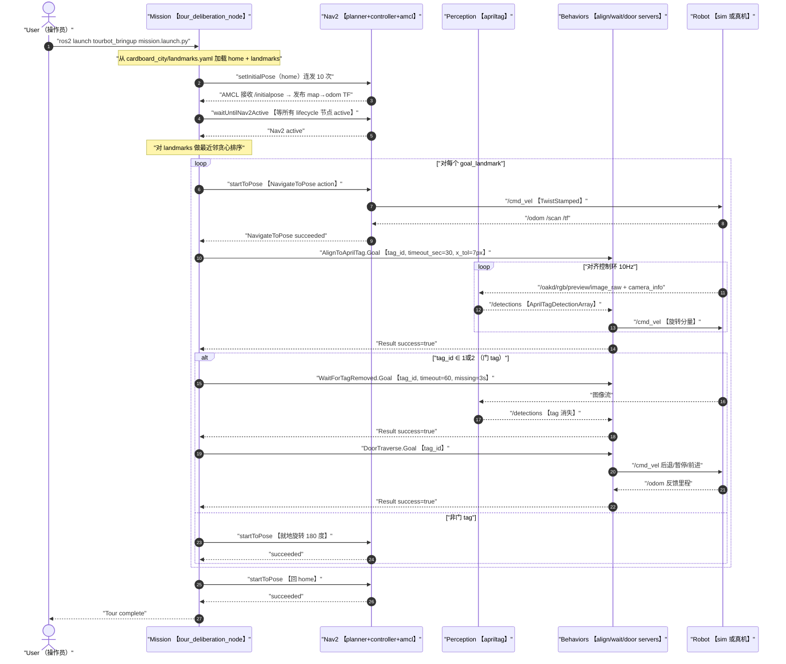
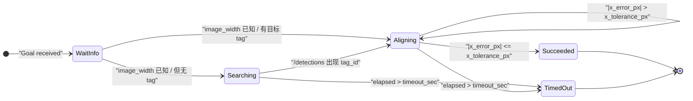
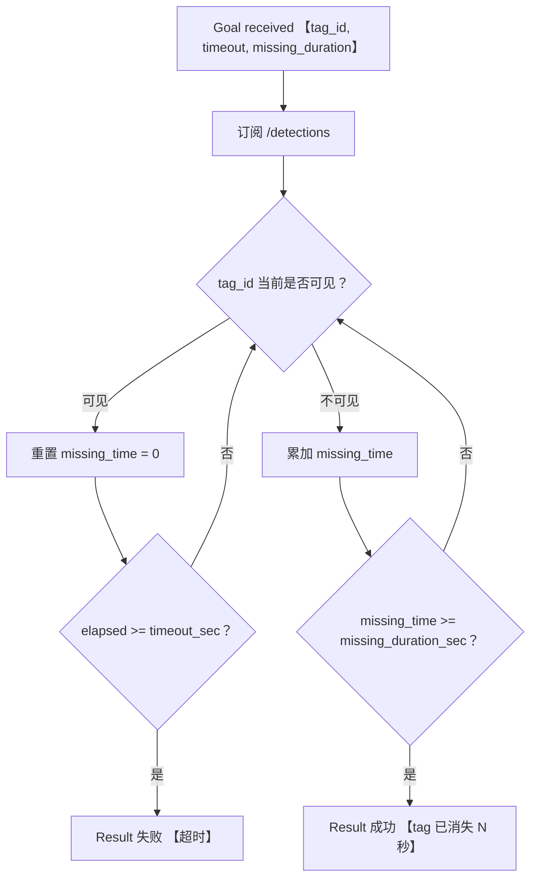
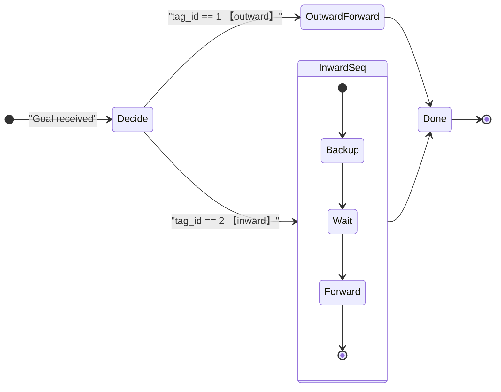
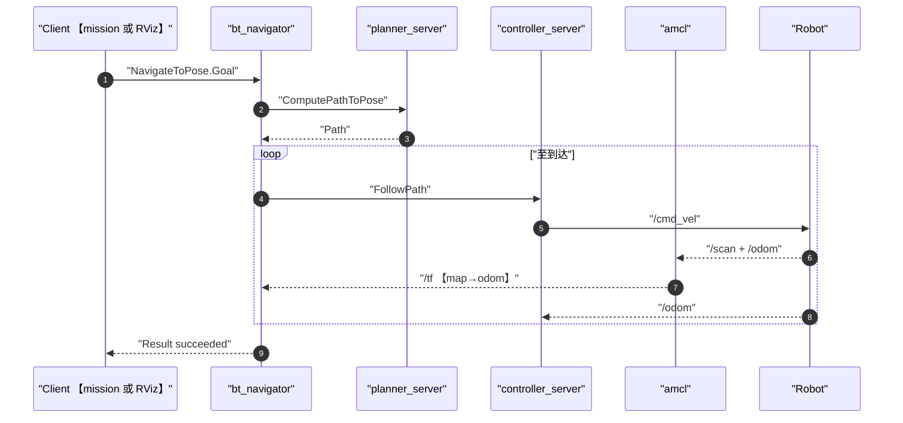

# 03 关键信令流程图：跑一次完整 tour 都发生了什么

> 适用对象：1-3 个月初学者
> 目标：理解从开机到完成一次巡游，**消息在哪里产生、被谁消费、产生什么副作用**。
> 用法：先看 §1 总览时序图建立直觉，再按 §2-§5 逐个行为细看。

---

## 1.顶层时序：一次完整 tour 的"全景图"

把所有参与者抽象成 6 个角色：

- **User**：人，启动 launch、点 RViz、拍门
- **Mission**：`tour_deliberation_node`，整场大脑
- **Nav2**：导航栈合集（planner / controller / bt_navigator / amcl ...）
- **Perception**：`apriltag` 节点
- **Behaviors**：三个 action server（align / wait / door）
- **Robot**：仿真或真实机器人本体（`/odom`、`/scan`、`/cmd_vel`、`/oakd/...`）

下图用 Mermaid 顺序图表示一次"启动 → 到 home → 走完所有 landmark → 回 home"的完整链路。注意所有节点 ID 用英文双引号包起来，标签里的括号用中文（）。



读这张图的提示：

- 圆括号 `()` 不能出现在 Mermaid 标签里，已经统一改成中文【】或（）。
- 自增编号 `autonumber` 让每一步左侧出现序号，便于在故障排查时引用。
- `loop ... end` 表达"对每个 landmark 重复一次"，与代码里 `for landmark in goal_landmarks` 对应。

---

## 2.AprilTag 对齐：`/align_to_apriltag`

这是最容易被新手误解的环节：**它只控制旋转，不前进，也不靠 TF**。



关键参数（写死在源码顶部常量）：

```text
SEARCH_ANGULAR_SPEED = 0.20   找 tag 时的转速 【rad/s】
ALIGN_KP             = 0.003  比例控制器增益 【rad/s per px】
MAX_ANGULAR_SPEED    = 0.30   旋转限幅
```

输入输出对照：

| 方向 | Topic / Action | 类型 |
|---|---|---|
| 订阅 | `/detections` | `apriltag_msgs/AprilTagDetectionArray` |
| 订阅 | `/oakd/rgb/preview/camera_info` | `sensor_msgs/CameraInfo` |
| 发布 | `/cmd_vel` | `geometry_msgs/TwistStamped` |
| 提供 | `/align_to_apriltag` | `tourbot_interfaces/AlignToAprilTag` |

---

## 3.等门 tag 消失：`/wait_for_tag_removed`

把"门是否打开"简化成"那张 tag 还看不看得见"。



`tour_deliberation_node` 调用时硬编码：

```python
wait_goal.timeout_sec          = 60.0
wait_goal.missing_duration_sec = 3.0
```

也就是说：tag 需要连续 3 秒不出现才算"门开了"，最多等 60 秒。

---

## 4.门穿越：`/door_traverse`

按 `tag_id` 分两套微动作：



默认参数：

```text
backup_distance_default  = 0.9 m
backup_speed_default     = 0.15 m/s
wait_seconds_default     = 3.0 s
forward_distance_default = 1.5 m   【相对原门位姿向前推进的距离】
forward_speed_default    = 0.18 m/s
control_rate_hz          = 20.0 Hz
```

注意 mission 在调用时**全部传 0**（依赖 server 端默认）：

```python
door_goal.backup_distance = 0.0
door_goal.backup_speed    = 0.0
door_goal.wait_seconds    = 0.0
door_goal.forward_distance = 0.0
door_goal.forward_speed    = 0.0
```

`server` 端检测到 0 时使用 `*_default`。

---

## 5.Nav2 单段导航内部信令（简化）

虽然 Nav2 内部很复杂，新手理解到下面这个程度就足够调试：



排查口诀：**"图不亮就是 TF 断；走不动就是 lifecycle 没 active；震荡就调 controller_server 参数；目标飘就调 amcl"**。

---

## 6.Mission 启动顺序：为什么要 `TimerAction`

`mission.launch.py` 不是把所有节点一次全启动，而是用 `TimerAction` 串行：

```mermaid
gantt
    title "mission.launch.py 启动节拍"
    dateFormat  s
    axisFormat  %S

    section perception
    "apriltag_pipeline.launch.py"   :a1, 0, 1
    section behaviors
    "align_to_apriltag_server"      :a2, 2, 1
    "wait_for_tag_removed_server"   :a3, 2.5, 1
    "door_behavior_server"          :a4, 3, 1
    section mission
    "tour_deliberation_node"        :a5, 10, 1
```



设计意图：

- 先让 perception 起来，否则 action server 启动时拿不到 `/detections`。
- 三个 behavior server 错峰启动，避免同时挂在 `/cmd_vel` 上互相干扰日志。
- mission 最后启动，确保所有 action server 都 ready。

---

## 7.如何把这些图用起来

读完上面的图之后，你可以做这些事：

1.对照 §1 顶层时序，**自己复述** 一次完整 tour 流程，能复述出来基本就理解了。
2.调试问题时，**先定位在哪一段** （Nav 段？对齐段？门段？），再看那段对应的图。
3.改代码前，**先在图上画一笔** 你想插入新行为的位置；如果画不出来，说明设计还没想清。
