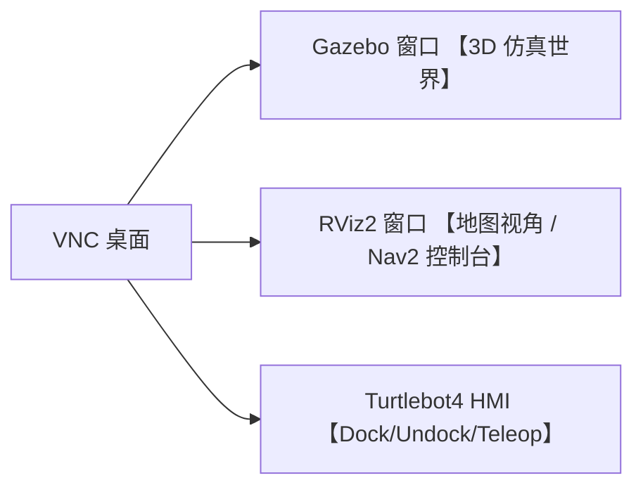

# 04 用户操作指南：不写代码也能跑起来

> 适用对象：1-3 个月初学者、第一次接触本工程的人
> 目标：在不修改任何源码的前提下，完成 **从启动到看到机器人巡游** 的完整流程。
> 平台：远端主机 `xiao-5080`（Ubuntu 24.04 + Docker + TurboVNC）。

---

## 0.阅读地图

```text
§1 准备工作      → 进 5080、起 VNC、检查 GPU
§2 一键起仿真    → docker compose --profile sim up sim
§3 看到机器人    → RViz2、Gazebo、TurtleBot4 HMI 长什么样
§4 发第一个目标  → 用 RViz2 Nav2 Goal 让机器人走
§5 启动完整 tour → 加上 mission 服务，看自动巡游
§6 收工与清理    → docker compose down，释放显存
§7 常见状况速查  → 6 种"卡住了"的快速诊断
```

---

## 1.准备工作

### 1.1 进入远端

在自己的笔记本上：

```bash
ssh xiao-5080
cd /home/xiaozy/4sim/gh-ref/tour-guide-robot/Hyaxon-tour-guide-robot
```

确认确实在 5080：

```bash
hostname
pwd
```

期望输出：

```text
5080-MS-eSport-Z890M
/home/xiaozy/4sim/gh-ref/tour-guide-robot/Hyaxon-tour-guide-robot
```

### 1.2 建 VNC 隧道并打开桌面

笔记本上另开一个终端：

```bash
ssh -N -L 5922:127.0.0.1:5922 xiao-5080
```

笔记本上用 TurboVNC Viewer 打开：

```bash
/opt/TurboVNC/bin/vncviewer localhost::5922
```

如果连不上，远端先把 VNC 起来：

```bash
~/scripts/start-turbovnc-vnc22.sh
```

### 1.3 简单体检

远端执行：

```bash
nvidia-smi --query-gpu=name,memory.used,memory.free --format=csv,noheader
docker --version
docker compose version
```

至少要有 5-6GB 空闲显存。如果显存被占，先看是谁在用，确认能不能释放。

---

## 2.一键起仿真

进入仓库根目录后：

```bash
export DC='docker compose -f docker_stuff/compose.yaml'
$DC --profile sim up sim
```

第一次会做两件事：

1.如果镜像还没有，先 `build` 一次镜像 `hyaxon-tour-guide-robot:jazzy`。
2.启动 Gazebo Harmonic + TurtleBot4 仿真 + Nav2 + RViz2。

**第一次启动会从 Gazebo Fuel 下载 warehouse 模型**，可能要 5-10 分钟，命令行里会刷 `Downloading model ...`。这不是卡死，耐心等。

启动成功的信号：

- VNC 桌面里出现 Gazebo 窗口、仓库样式的 3D 场景、机器人模型。
- 旁边出现 RViz2 窗口（标题含 `navigation.rviz`）。
- 右下角出现 `Turtlebot4 HMI` 面板。

---

## 3.看到机器人后认识界面



- **Gazebo**：3D 物理仿真，机器人和环境的"真身"在这里。
- **RViz2**：导航视角，你将主要在这里点目标。
- **TurtleBot4 HMI**：右下角小面板，做对接、解锁、急停、墙跟随等仿真控制；**它不是发地图导航目标的地方**。

RViz2 左下角的 `Navigation 2` 面板要看到：

- `Localization: active`
- `Navigation: active`
- 中间地图区域显示 cardboard_city（或 warehouse）地图

如果显示 inactive，先按 §7.1 处理。

---

## 4.发第一个导航目标

### 4.1 设初始位姿（只第一次需要）

在 RViz2 工具栏点 `2D Pose Estimate`，在地图上你认为机器人当前应该在的位置点击一下，再拖出朝向。

成功标志：

- AMCL 立刻开始发布 `map→odom` TF
- RViz2 里机器人模型变绿色或正常颜色
- `Navigation 2` 面板的 `Localization` 变成 `active`

### 4.2 发目标

工具栏点 `Nav2 Goal`，在地图上离机器人不远的空地上点一下，再拖出朝向。

期望：

- 蓝色 plan 线生成
- 机器人开始旋转、移动
- 到达后 `Navigation` 状态返回 idle

如果机器人在 Gazebo 里看着"没动"，不要急着判断失败，先看 §7.4。

---

## 5.启动完整 tour（自动巡游）

仿真已经在跑的情况下，**另开一个远端终端**：

```bash
cd /home/xiaozy/4sim/gh-ref/tour-guide-robot/Hyaxon-tour-guide-robot
export DC='docker compose -f docker_stuff/compose.yaml'
$DC --profile mission up mission
```

这一个服务会把：

- AprilTag 感知 pipeline
- 三个 behavior server（align / wait / door）
- `tour_deliberation_node`（大脑）

全部起来。启动时间见 `mission.launch.py` 节拍图（参见 [03-signal-flows.md §6](./03-signal-flows.md)）。

10 秒后 `tour_deliberation_node` 会：

1.把 home 当作初始位姿广播 10 次给 AMCL。
2.等 Nav2 active。
3.对所有 landmark 做最近邻贪心排序。
4.挨个去：导航 → 对齐 tag → （若是门 tag）等门开 + 穿门 → （否则）就地转 180°。
5.最后回 home，日志打 `Tour complete`。

**重要**：当前 `cardboard_city/world.sdf` 只有空场景，没有真正的 tag 模型，因此对齐步骤会反复转直至超时。要看到完整 tour 真实跑通，需要补 world 资产（参见 [05-dev-guide.md §5](./05-dev-guide.md)）或用合成 `/detections`（参见 [03 文档](./03-signal-flows.md)）。

---

## 6.收工与清理

按 `Ctrl+C` 终止前台 compose 命令。彻底关掉所有容器：

```bash
$DC --profile sim --profile robot --profile mission down
```

确认没有遗留：

```bash
$DC ps --all
nvidia-smi --query-compute-apps=pid,process_name,used_memory --format=csv
```

如果还看到 `gz sim` / `rviz2` / `ruby` 在占显存，说明有孤儿进程：

```bash
$DC down --remove-orphans
```

---

## 7.常见状况速查

### 7.1 Nav2 一直 inactive

最常见原因：lifecycle 节点没激活，或没设初始位姿。

```bash
$DC run --rm --no-deps dev bash -lc \
  'source install/setup.bash && ros2 lifecycle nodes && ros2 lifecycle get /amcl'
```

如果 `amcl` 不是 `active`：

- 先在 RViz2 点 `2D Pose Estimate`，给一个粗略初值。
- `sim.launch.py` 已经在 30s 后再起 localization/Nav2/RViz；如果你太早点目标会无响应，等等。
- `nav2_post_localization_activator` 节点存在的目的就是 TF 稳定后自动激活后续 lifecycle 节点。

### 7.2 Gazebo 启动一会儿后退出

抓关键日志：

```bash
$DC logs sim 2>&1 | grep -nE 'symbol lookup error|undefined symbol|SIGKILL'
```

- 看到 `undefined symbol ... diagnostic_updater::Updater` → ABI 不匹配，参见 [007 SOP §4.2 FAQ](../007-sim-full-funtion-sop.md)；解决办法：重建镜像。
- 看到 `Downloading model ... fuel.gazebosim.org` 持续刷 + spawner 超时 → 第一次下载太慢，等模型缓存好后 `$DC restart sim`。

### 7.3 RViz2 / Gazebo 很卡

`xiao-5080` 上的 GUI 默认走 TurboVNC，需要 VirtualGL 才能用上 GPU：

```bash
$DC exec -T sim bash -lc 'DISPLAY=:22 vglrun -d :0 glxinfo -B | grep "OpenGL renderer"'
```

期望看到 `NVIDIA GeForce RTX 5080/PCIe/SSE2`。如果还是 `Mesa llvmpipe`，确认 `compose.yaml` 里 `sim` 服务的 command 用了 `vglrun -d :0`，且镜像装了 `virtualgl`。

### 7.4 点 Nav2 Goal 后机器人"没动"

很可能其实动了，只是看着慢或局部抖。逐项排查：

```bash
ros2 action send_goal /navigate_to_pose nav2_msgs/action/NavigateToPose \
  "{pose: {header: {frame_id: 'map'}, pose: {position: {x: 0.5, y: 0.0, z: 0.0}, orientation: {w: 1.0}}}}" \
  --feedback
```

- 终端有 feedback 持续刷 → mission 链路通了
- 看 `/cmd_vel`：`ros2 topic echo /cmd_vel` 应该有非零线速度或角速度
- 看 Gazebo 真实位姿：`ros2 topic echo /_internal/sim_ground_truth_pose --once`
- 还可参考 [009-ui-operate-guide.md](../009-ui-operate-guide.md) §9 现场排查记录

### 7.5 提示找不到 `tourbot_*` 包

每次进容器都要 `source install/setup.bash`，否则 ROS 不知道仓库自研包在哪。

```bash
$DC run --rm --no-deps dev bash
# 在容器里：
source install/setup.bash
ros2 pkg list | grep tourbot
```

### 7.6 想直接进容器手动玩

```bash
$DC run --rm --no-deps dev bash
source install/setup.bash
```

然后随便用 `ros2 topic`、`ros2 action`、`ros2 run` 跑命令，不会影响外面正在 up 的服务（注意 `ROS_DOMAIN_ID` 默认 42，会和 sim 在同一域里聊天）。

如果不想干扰：

```bash
ROS_DOMAIN_ID=142 $DC run --rm --no-deps dev bash
```

---

## 8.下一步

- 想知道我刚启动的这堆节点之间是什么关系？看 [02-topology.md](./02-topology.md)。
- 想了解一次 tour 从开机到结束的完整信令？看 [03-signal-flows.md](./03-signal-flows.md)。
- 想自己改 landmark / 加新行为？看 [05-dev-guide.md](./05-dev-guide.md)。
- 命令记不住？看 [06-quick-reference.md](./06-quick-reference.md)。
